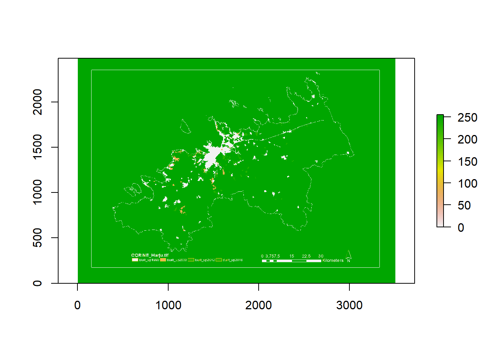
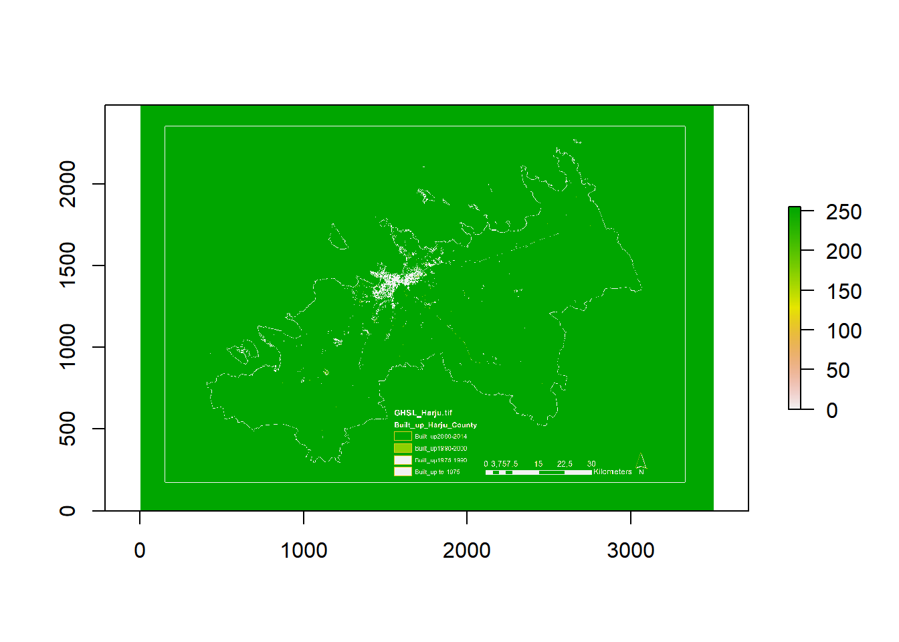
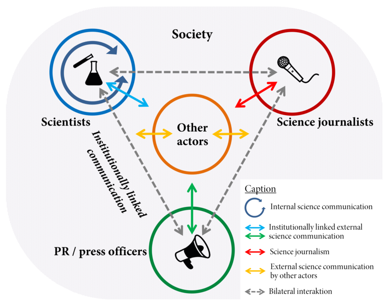

# Introduction

Urban expansion is a complex and dynamic process and plays a significant role in modifying the use of land. It involves changes in physical and functional components of built environment and subsequently accelerates the transition of landscape to urban forms.

The most important aim of this reaerch is to reach an idea of why and how cities extend in different context of physical, social and economic during the time!

As it needs a lot of efforts, we divided the problem into three parts and at the first stage we worked just with the physical dimension of urban expansion. It means that we analyzed the dynamic land use changes and extracted the urban areas in different timestamps from the two remotely sense datasets of CORINE land cover and GHSL; Built-Up Grid to map urban expansion at local level for Harju conuty in its context (County) in Estonia between 1990 and 2018.

# Research Framework

This thesis has two key parts:

At first I will analyze the spatial data of urban expansion. And secondly, I will visualize the spatial data of urban expansion, to make it more understandable for wide public and decision makers.

## Data Types

_Remotely Sensed Data_ - There were two possibility for me to extract my data:

I download the whole data from their official websites as follows, and classify the data and then extract the final maps of urban expansion.

```
CORINE2018 <- url("https://land.copernicus.eu/pan-european/corine-land-cover/clc2018")
CORINE2012 <- url("https://land.copernicus.eu/pan-european/corine-land-cover/clc2012")
CORINE2006 <- url("https://land.copernicus.eu/pan-european/corine-land-cover/clc2006")
CORINE2000 <- url("https://land.copernicus.eu/pan-european/corine-land-cover/clc2000")
CORINE1990 <- url("https://land.copernicus.eu/pan-european/corine-land-cover/clc1990")
GHSL_BUILT_UP <- url("https://ghsl.jrc.ec.europa.eu/download.php")
```

I can work on my data in GOOGLE EARTH ENGINE using code editor and extract just the final maps of urban expansion.

I choose the second one and I work on the final products in ArcMap to exctract the final analysis.

## Data Processing

I use Google Earth Engine(GEE) platform and ArcMap from the products of ArcGIS Desktop 10.6.

## Data Reproducibility

I extracted two urban expansion maps from the two satellite databases, GHSL- Built up layer and CORINE land cover database. I resampled them in to a unique unit (30-meter resolution) to make them ready to compare, then I use some annual growth rate, cell density analysis and image difference analysis.

```
require(raster)

 > Loading required package: raster

 > Loading required package: sp
```

```
r1 <- raster ("D:/PhD/thesis/Third semester/conferences/GISTAM-6th-Czech/EXPORT MAPS/CORINE-harju.tif")

r2 <- raster("D:/PhD/thesis/Third semester/conferences/GISTAM-6th-Czech/EXPORT MAPS/gGHSL-HARJU.tif")

plot(r1)
```

```{r, echo = FALSE, out.width="100%", fig.cap="Plot of CORINE Landcover over Harju county"}

```

```
plot(r2)
```

```{r, echo = FALSE, out.width="100%", fig.cap="Plot of Global Human Settlement Layer over Harju county"}

```

# Science Communication

I learned that I can visualize my data in QGIS and use Time manager Plugin to make it more dynamic rather than be static. I learn I can use Github to make the repository for my work and commit it whenever I want and of course share it with my supervisor to have an interactive editing our paper.

```{r, echo = FALSE, out.width="100%", fig.cap="Science Communication workflows interlinked"}

```
